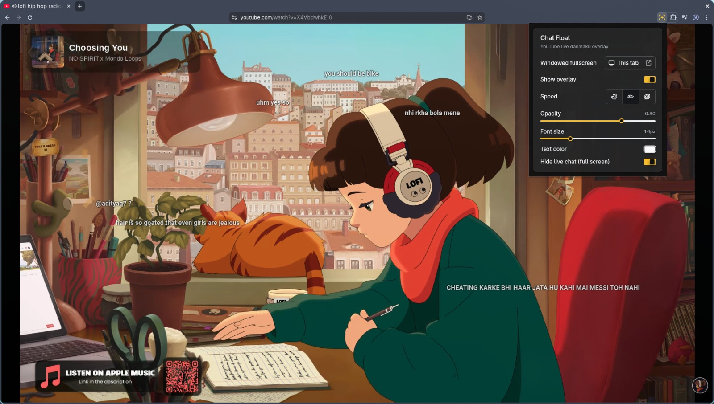

# Chat Float

Chat Float is a browser extension that floats YouTube live chat over the video as a customizable danmaku overlay. It includes a popup for overlay settings, a content-script overlay on watch/live pages, and optional windowed fullscreen controls.



## Features

- Float live chat messages over YouTube watch and live videos
- Toggle the overlay on or off from the popup
- Adjust animation speed (fast / normal / slow)
- Control overlay opacity and text color
- Hide native YouTube chat panels for a full-bleed video layout
- Open windowed fullscreen in the current tab or a popup window
- Skip historical chat backlog when opening a live page or returning from a hidden tab
- Support Chrome, Firefox, and Edge builds

## Requirements

- Node.js `22+`
- npm

## Getting Started

Install dependencies:

```bash
npm install
```

Start the development workflow:

```bash
npm run dev
```

Build the extension:

```bash
npm run build
```

Create release archives for supported browsers:

```bash
npm run release
```

## Load the Extension in Chrome

### Option 1: Load the unpacked build

1. Open `chrome://extensions/`
2. Enable **Developer mode**
3. Click **Load unpacked**
4. Select the `dist/chrome` directory

### Option 2: Load from the generated ZIP

1. Extract `dist/release/Chat-Float-Chrome-<version>.zip`
2. Open `chrome://extensions/`
3. Enable **Developer mode**
4. Click **Load unpacked**
5. Select the extracted folder

## Settings

Open the extension popup to configure:

1. **Show overlay** — enable or disable the danmaku overlay
2. **Speed** — choose fast, normal, or slow animation
3. **Opacity** — adjust overlay transparency
4. **Text color** — pick the chat text color
5. **Hide panels / full-bleed** — hide native chat panels for a wider video view
6. **Windowed fullscreen** — apply to this tab or open a dedicated popup

## Project Structure

```text
src/
├── action/         # Popup UI for overlay settings
├── background.ts   # Service worker
├── content/        # Content scripts, overlay, player controls
├── components/     # Shared UI components
├── sidebar/        # Side panel entry
├── hooks/          # Shared React hooks
└── lib/            # Shared utilities
```

## Open Source

- License: MIT

## Notes for Maintainers

- Keep `package.json` and `src/manifest.json` version fields in sync before releasing
- Run `npm run release` to build Chrome, Firefox, and Edge archives under `dist/release/`
- Replace preview assets and store listing content before submitting to browser stores
